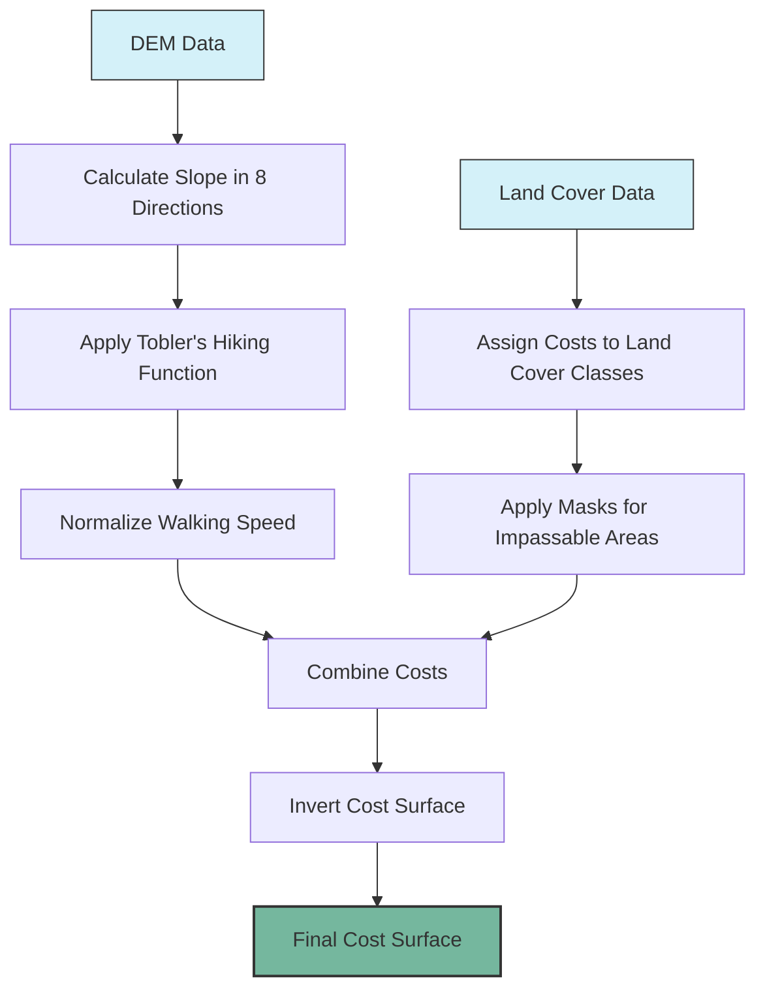

# Cost Surface Generation

This page describes the process of generating cost surfaces for volcanic evacuation analysis. Cost surfaces represent the difficulty of traversing different types of terrain and are essential for realistic evacuation route modeling.

## Overview

The cost surface generation workflow combines two key factors:

1. **Slope-based costs**: Derived from the Digital Elevation Model (DEM) using Tobler's hiking function
2. **Land cover costs**: Assigned based on different terrain types from land cover classification

These factors are integrated to create comprehensive cost surfaces that account for both topographic and land cover characteristics, resulting in realistic travel time estimates.

## Prerequisites

Before generating cost surfaces, ensure you have:

1. Completed the [Data Acquisition](data-acquisition.md) step
2. Downloaded DEM and land cover data for your volcano of interest
3. Installed the required dependencies as specified in the [Installation Requirements](installation-requirements.md)

## Workflow Diagram

The cost surface generation process follows these steps:



## Step 1: Calculate Slope from DEM

First, calculate the slope in eight directions (cardinal and intercardinal) from the DEM:

```python
from dem_processing import calculate_slope
import numpy as np
import rasterio

# Load the DEM
with rasterio.open("Volcano_DEM_100m_Buffer_UTM.tif") as src:
    dem_data = src.read(1)
    dem_meta = src.meta
    resolution_x = src.res[0]
    resolution_y = src.res[1]
    no_data = src.nodata

# Calculate slope in 8 directions
slope_array = calculate_slope(dem_data, resolution_x, resolution_y, no_data)

# slope_array shape: (8, rows, cols) - one array for each direction
print(f"Calculated slope in 8 directions. Shape: {slope_array.shape}")
```

The resulting `slope_array` contains slopes for each of the eight movement directions: North, South, East, West, North-East, North-West, South-East, and South-West.

## Step 2: Apply Tobler's Hiking Function

Next, apply Tobler's hiking function to convert slopes to walking speeds:

```python
from dem_processing import calculate_walking_speed, normalize_walking_speed

# Calculate walking speed using Tobler's function
walking_speed_array = calculate_walking_speed(slope_array)

# Normalize walking speed by dividing by max speed (occurs at slight downhill)
normalized_ws = normalize_walking_speed(walking_speed_array)

print(f"Applied Tobler's hiking function to calculate walking speeds")
```

Tobler's hiking function models how walking speed varies with slope:

$$ V = 6 \times e^{-3.5 \times |S + 0.05|} $$

Where:
- V is the walking speed in km/h
- S is the slope in rise/run (not degrees)
- The constant 0.05 accounts for the observation that walking is slightly faster on gentle downhill slopes

## Step 3: Assign Costs to Land Cover Classes

In parallel, assign cost factors to different land cover types:

```python
from cost_calculations import map_landcover_to_cost
import rasterio

# Load land cover data
with rasterio.open("Volcano_LandCover_2019_100m_Buffer_UTM.tif") as src:
    landcover_data = src.read(1)
    lc_meta = src.meta

# Define cost mapping for different land cover classes
# Values represent difficulty multipliers (1.0 = normal speed, 2.0 = half speed)
land_cover_cost_mapping = {
    0: np.nan,       # No data
    20: 1.0,         # Shrubs
    30: 1.2,         # Herbaceous vegetation
    40: 1.5,         # Cropland
    50: 2.0,         # Urban/built-up
    60: 1.0,         # Bare/sparse vegetation
    70: 1.5,         # Snow and ice
    80: 1.2,         # Permanent water bodies
    90: 2.0,         # Herbaceous wetland
    100: 2.0,        # Moss and lichen
    111: 1.3,        # Closed forest, evergreen needle leaf
    112: 1.3,        # Closed forest, evergreen broad leaf
    113: 1.3,        # Closed forest, deciduous needle leaf
    114: 1.3,        # Closed forest, deciduous broad leaf
    115: 1.3,        # Closed forest, mixed
    116: 1.2,        # Closed forest, unknown
    121: 1.2,        # Open forest, evergreen needle leaf
    122: 1.2,        # Open forest, evergreen broad leaf
    123: 1.2,        # Open forest, deciduous needle leaf
    124: 1.2,        # Open forest, deciduous broad leaf
    125: 1.2,        # Open forest, mixed
    126: 1.1,        # Open forest, unknown
    200: 1000.0      # Impassable (streams, cliffs)
}

# Map land cover classes to costs
landcover_cost = map_landcover_to_cost(landcover_data, land_cover_cost_mapping)

print(f"Assigned costs to land cover classes")
```

The land cover cost mapping assigns different travel difficulty factors to each land cover type. For example:
- Open terrain (bare/sparse vegetation): 1.0 (no speed reduction)
- Forests: 1.2-1.3 (20-30% speed reduction)
- Urban areas: 2.0 (50% speed reduction)
- Impassable areas (water bodies, steep cliffs): 1000.0 (effectively impassable)

## Step 4: Apply Masks for Special Features

Some features may need special handling. For example, hiking trails should be easier to traverse, while streams may be impassable:

```python
from cost_calculations import update_cost_raster, rasterize_layer
import geopandas as gpd

# Load hiking path and streams from shapefiles
hiking_paths = gpd.read_file("hiking_path.shp")
streams = gpd.read_file("streams.shp")

# Rasterize hiking paths and streams
with rasterio.open("Volcano_DEM_100m_Buffer_UTM.tif") as src:
    transform = src.transform
    out_shape = src.shape

hiking_raster = rasterize_layer(
    hiking_paths.geometry,
    out_shape,
    transform,
    burn_value=1,
    fill_value=np.nan
)

stream_raster = rasterize_layer(
    streams.geometry,
    out_shape,
    transform,
    burn_value=0,
    fill_value=np.nan
)

# Update cost raster with hiking paths and streams
# Hiking paths: set cost to 1 (easy to traverse)
# Streams: set cost to 0 (impassable)
updated_cost_raster = update_cost_raster(landcover_cost, stream_raster, hiking_raster)

print(f"Applied masks for hiking paths and streams")
```

This step overlays vector features like hiking paths and streams onto the cost surface, making hiking paths easier to traverse and streams impassable.

## Step 5: Combine Slope-Based and Land Cover Costs

Now combine the slope-based costs (from Tobler's function) with the land cover costs:

```python
from cost_calculations import adjust_cost_with_walking_speed

# Create separate bands for each direction
adjusted_cost_array = np.zeros_like(normalized_ws)

# Adjust cost by multiplying normalized walking speed with land cover costs
for direction in range(8):
    adjusted_cost_array[direction] = adjust_cost_with_walking_speed(
        normalized_ws[direction],
        updated_cost_raster
    )

print(f"Combined slope-based and land cover costs")
```

This multiplication effectively reduces walking speed based on both slope steepness and terrain type.

## Step 6: Invert the Cost Surface for Path Finding

For path finding algorithms, we need to invert the cost surface (since higher speeds should result in lower costs):

```python
from cost_calculations import invert_cost_array

# Invert the cost array (1/cost) for use in path finding
inverted_cost_array = invert_cost_array(adjusted_cost_array)

print(f"Inverted cost surface for path finding")
```

The inversion converts speed values to cost values, where:
- Higher speeds → Lower costs
- Lower speeds → Higher costs
- Impassable areas → Very high cost or infinity

## Step 7: Save the Final Cost Surface

Finally, save the cost surface for use in evacuation analysis:

```python
import os

# Save the inverted cost array
output_path = os.path.join("output", "inverted_cost_8_directions.tif")
with rasterio.open(
    output_path, 
    'w',
    driver='GTiff',
    height=inverted_cost_array.shape[1],
    width=inverted_cost_array.shape[2],
    count=inverted_cost_array.shape[0],
    dtype=inverted_cost_array.dtype,
    crs=dem_meta['crs'],
    transform=dem_meta['transform'],
    nodata=np.nan
) as dst:
    dst.write(inverted_cost_array)

print(f"Saved final cost surface to {output_path}")
```

## Visualizing the Cost Surface

To better understand the cost surface, you can visualize it:

```python
from plotting_utils import plot_continuous_raster_with_points
import geopandas as gpd

# Load summit point
summit_point = gpd.read_file("summit.shp")

# Plot one direction (e.g., North)
north_direction = 0
plot_continuous_raster_with_points(
    inverted_cost_array[north_direction],
    [dem_meta['transform'][2], dem_meta['transform'][2] + dem_meta['transform'][0] * dem_meta['width'],
     dem_meta['transform'][5] + dem_meta['transform'][4] * dem_meta['height'], dem_meta['transform'][5]],
    summit_point,
    "Cost Surface (North Direction)",
    "Cost Value",
    "cost_surface_north.jpg"
)
```

## Scenario Analysis

You can generate multiple cost surfaces to compare different scenarios:

1. **Base Scenario**: Standard land cover and slope costs
2. **Degraded Terrain**: Increase costs for certain land cover types to simulate adverse conditions (e.g., wet ground after rainfall)
3. **Infrastructure Damage**: Mark certain paths as impassable to simulate damaged infrastructure
4. **Seasonal Variation**: Adjust costs based on seasonal conditions (e.g., snow cover in winter)

Example of creating a modified scenario:

```python
# Modify land cover costs for a "wet terrain" scenario
wet_terrain_mapping = land_cover_cost_mapping.copy()
wet_terrain_mapping.update({
    20: 1.5,         # Shrubs (increased difficulty when wet)
    30: 1.8,         # Herbaceous vegetation (increased difficulty when wet)
    60: 1.3,         # Bare/sparse vegetation (increased difficulty when wet)
})

# Generate a new cost surface with these modified values
# ... (repeat steps 3-7 with the new mapping)
```

## Parameter Sensitivity

The cost surface is sensitive to several parameters:

1. **Land cover cost values**: Different multipliers for land cover types
2. **Walking speed parameters**: Constants in Tobler's function
3. **Special feature handling**: How hiking paths and impassable features are treated

It's recommended to perform sensitivity analysis by varying these parameters and comparing the resulting evacuation routes and times.

## Next Steps

With the cost surface generated, you can now proceed to the [Evacuation Analysis](evacuation-analysis.md) workflow to:

1. Calculate optimal evacuation routes from various starting points
2. Estimate evacuation times for different scenarios
3. Analyze the accessibility of safe zones

## Troubleshooting

### Missing or Incorrect Land Cover Mapping

If land cover classes in your study area are not properly represented in the default mapping:

1. Use GIS software to identify the unique land cover classes in your data
2. Update the `land_cover_cost_mapping` dictionary to include all classes
3. Consult literature or local knowledge to assign appropriate cost values

### Unrealistic Travel Times

If the calculated travel times seem unrealistic:

1. Check the slope calculation to ensure units are correct (rise/run, not degrees)
2. Verify the land cover cost multipliers are reasonable
3. Consider calibrating the model using known travel times from field measurements

### Memory Issues with Large Datasets

For very large study areas, you may encounter memory issues:

1. Process the data in tiles or with a reduced buffer size
2. Decrease the spatial resolution of the analysis
3. Use a computer with more RAM or consider cloud computing options
