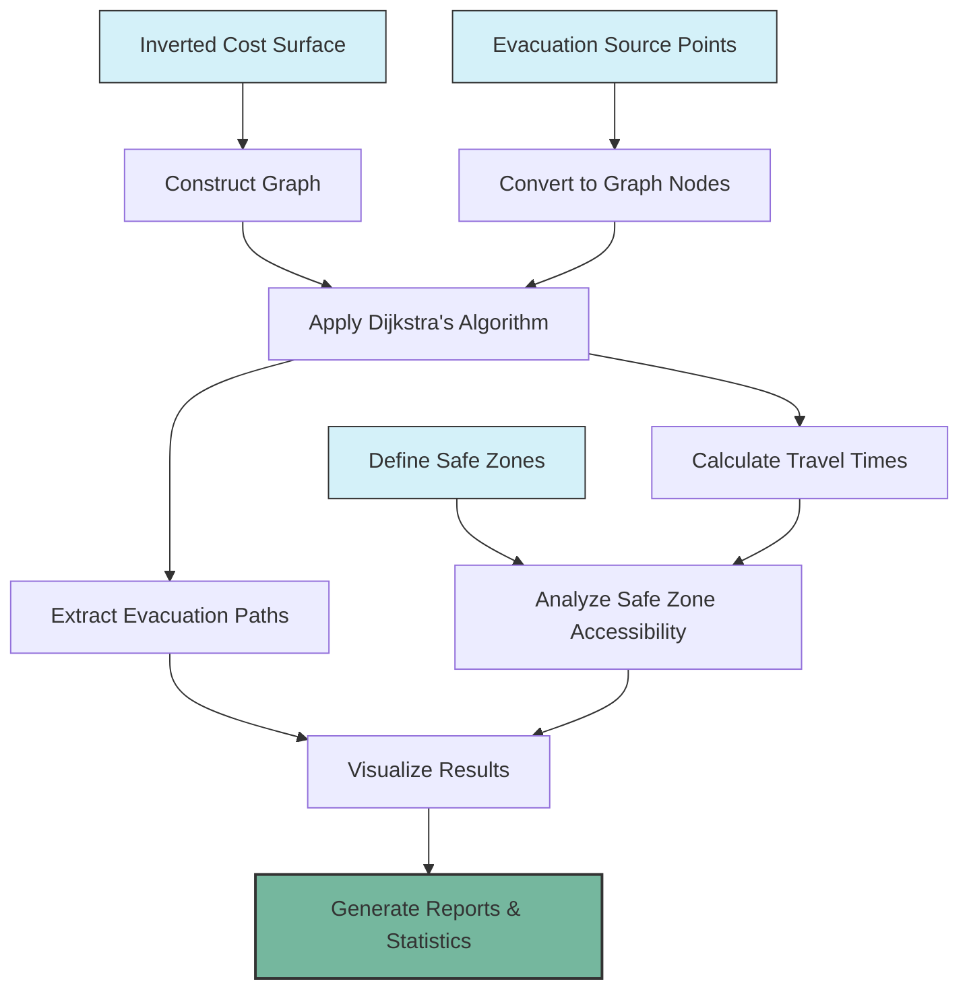

# Evacuation Analysis

This page explains how to use the generated cost surfaces to analyze evacuation scenarios, calculate optimal routes, and determine evacuation times from volcanic hazards.

## Overview

The evacuation analysis builds upon the cost surfaces created in the previous step to:

1. Calculate optimal evacuation routes using Dijkstra's algorithm
2. Determine travel times to safe zones for different walking speeds
3. Analyze evacuation scenarios based on volcano-specific parameters
4. Visualize results to support evacuation planning

## Prerequisites

Before performing evacuation analysis, ensure you have:

1. Completed the [Cost Surface Generation](cost-surface.md) workflow
2. Generated the inverted cost surface raster
3. Prepared point data for evacuation sources (summit, camps, settlements)
4. Defined safe zone parameters based on volcanic hazard assessments

## Workflow Diagram

The evacuation analysis process follows these steps:



## Step 1: Set Up Configuration Parameters

First, configure the analysis parameters:

```python
from config import WALKING_SPEEDS, SOURCE_NAMES, SAFE_ZONE_DISTANCES, DIRECTIONS

# Walking speeds in m/s for different scenarios
# These represent slow, medium, and fast walking paces
print(f"Walking speeds: {WALKING_SPEEDS}")

# Source locations to analyze (summit and camping areas)
print(f"Evacuation sources: {SOURCE_NAMES}")

# Safe zone distances in meters
print(f"Safe zone distances: {SAFE_ZONE_DISTANCES}")

# Movement directions (cardinal and intercardinal)
print(f"Movement directions: {DIRECTIONS}")
```

The key parameters include:
- **Walking speeds**: Different speeds for various population groups or scenarios
- **Source locations**: Starting points for evacuation (summit, camps, settlements)
- **Safe zone distances**: Distances from the summit considered safe
- **Movement directions**: The 8 directions for path finding (cardinal and intercardinal)

## Step 2: Load Cost Surface and Convert to Graph

Next, load the inverted cost surface and convert it to a graph structure for path finding:

```python
from io_utils import read_raster
from path_utils import build_adjacency_matrix
import numpy as np

# Load the inverted cost raster
cost_array, meta, transform, nodata, bounds, resolution = read_raster("inverted_cost_8_directions.tif")

# Get dimensions
bands, rows, cols = cost_array.shape
print(f"Cost surface dimensions: {bands} bands, {rows} rows, {cols} columns")

# Build adjacency matrix (graph) for path finding
graph_csr = build_adjacency_matrix(cost_array, rows, cols, DIRECTIONS)
print(f"Built graph with {graph_csr.shape[0]} nodes and {graph_csr.nnz} edges")
```

This step constructs a sparse graph representation where:
- Each cell in the raster becomes a node in the graph
- Connections between adjacent cells become edges
- Edge weights are determined by the cost of moving between cells

## Step 3: Define Source Locations and Convert to Graph Nodes

Now, convert the source locations (evacuation starting points) to graph nodes:

```python
from io_utils import read_shapefile
from grid_utils import coords_to_raster, to_1d

# Load source points (summit, camps, etc.)
summit_gdf = read_shapefile("summit.shp")
camps_gdf = read_shapefile("camps.shp")

# Convert geographic coordinates to raster row/col coordinates
summit_coords = coords_to_raster(summit_gdf, transform, bounds, resolution)
camps_coords = coords_to_raster(camps_gdf, transform, bounds, resolution)

# Combine all source coordinates
source_coords = summit_coords + camps_coords
print(f"Source coordinates (row, col): {source_coords}")

# Convert 2D source coordinates to 1D node indices for graph
source_nodes = [to_1d(r, c, cols) for r, c in source_coords]
print(f"Source nodes: {source_nodes}")
```

This converts the geographic coordinates of evacuation sources (e.g., volcano summit, camping areas) to the corresponding nodes in the graph.

## Step 4: Run Dijkstra's Algorithm for Shortest Paths

Apply Dijkstra's algorithm to find the shortest paths from all source points:

```python
from analysis import run_dijkstra_analysis

# Run Dijkstra's algorithm to find shortest paths from all sources
distances, predecessors = run_dijkstra_analysis(graph_csr, source_nodes)

print(f"Calculated shortest paths from {len(source_nodes)} sources")

# Store predecessor arrays for path reconstruction
# Assuming summit is the first source
predecessor_summit = predecessors[0]
```

Dijkstra's algorithm efficiently finds the optimal paths from each source point to all other points in the area. The algorithm returns:
- **Distances**: Accumulated cost to reach each cell from each source
- **Predecessors**: For each cell, which neighboring cell leads back to the source

## Step 5: Calculate Distance from Summit for Safe Zones

Calculate the Euclidean distance from the summit to define safe zones:

```python
from grid_utils import calculate_distance_from_summit

# Calculate distance from summit for defining safe zones
summit_row, summit_col = source_coords[0]  # Assuming summit is the first source
distance_from_summit = calculate_distance_from_summit(
    (summit_row, summit_col), rows, cols, cell_size=resolution[0])

print(f"Calculated Euclidean distance from summit")
```

This creates a raster where each cell contains its straight-line distance from the volcano summit, which will be used to define safe zones at various distances.

## Step 6: Process Travel Times for Different Walking Speeds

Convert cost distances to travel times for different walking speeds:

```python
from analysis import process_travel_times
import os

# Create output directory if it doesn't exist
os.makedirs("output", exist_ok=True)

# Process travel times for each source and walking speed
for i, source_name in enumerate(SOURCE_NAMES):
    for speed_name, speed_value in WALKING_SPEEDS.items():
        # Convert cost distance to travel time (in hours)
        # Save results as GeoTIFF files
        travel_time_array = process_travel_times(
            f"cost_distance_{source_name}.tif",
            source_name,
            "final",  # dataset key
            speed_name,
            speed_value,
            meta
        )
        
        print(f"Processed travel times for {source_name} at {speed_name} speed")
```

This step converts the abstract cost distances into practical travel times based on different walking speeds, which are more meaningful for evacuation planning.

## Step 7: Analyze Safe Zone Accessibility

Now analyze how long it takes to reach safe zones from each evacuation source:

```python
from analysis import analyze_safe_zones

# First, collect all the travel time data
travel_time_data = {}
for speed_name in WALKING_SPEEDS.keys():
    travel_time_data[speed_name] = {}
    for source_name in SOURCE_NAMES:
        # Load travel time raster
        travel_time_path = f"output/cost_distance_{source_name}_final_{speed_name}_hours.tif"
        with rasterio.open(travel_time_path) as src:
            travel_time_array = src.read(1)
            # Replace nodata with NaN
            travel_time_array = np.where(
                travel_time_array == src.nodata, 
                np.nan, 
                travel_time_array
            )
            
        travel_time_data[speed_name][source_name] = {
            'cost_array': travel_time_array,
            'cost_array_flat': travel_time_array.ravel()
        }

# Analyze minimum travel times to reach each safe zone
results, min_coords = analyze_safe_zones(
    distance_from_summit,
    travel_time_data,
    SAFE_ZONE_DISTANCES,
    SOURCE_NAMES
)

print(f"Analyzed safe zone accessibility")
```

This analysis identifies:
- The minimum travel time to reach each safe zone from each source
- The location (coordinates) where that minimum time is achieved
- How different walking speeds impact evacuation feasibility

## Step 8: Decompose Factor Contributions

To better understand what influences evacuation routes, decompose the contributing factors:

```python
from decomposition import run_decomposition_analysis

# Prepare dataset info for decomposition
dataset_info = {
    'final': {
        'pred_summit': predecessor_summit,
        'cols': cols,
        'summit_raster_coords': source_coords[0]
    }
}

# Run decomposition analysis to understand factor contributions
decomp_data = run_decomposition_analysis(dataset_info, min_coords)

print(f"Decomposed factor contributions to evacuation paths")
```

This analysis reveals the relative importance of slope versus land cover in determining the optimal evacuation paths, which can inform mitigation strategies.

## Step 9: Save Analysis Results

Save the results to various formats for reporting and further analysis:

```python
from io_utils import save_analysis_report, save_metrics_csv
from visualization import create_decomposition_table, create_final_evacuation_table

# Save analysis report and metrics as text and CSV
report_path = save_analysis_report(
    "output/evacuation_analysis_report.txt",
    results,
    min_coords,
    SOURCE_NAMES,
    WALKING_SPEEDS,
    SAFE_ZONE_DISTANCES
)

csv_path = save_metrics_csv(
    "output/evacuation_metrics.csv",
    results,
    min_coords,
    SOURCE_NAMES,
    WALKING_SPEEDS,
    SAFE_ZONE_DISTANCES
)

# Create visual tables
decomp_table_path = create_decomposition_table(
    decomp_data,
    "output/factor_decomposition_table.png"
)

evac_table_path = create_final_evacuation_table(
    {"final": results},
    SOURCE_NAMES,
    "output/evacuation_time_table.png"
)

print(f"Saved analysis results and visualizations")
```

These reports and visualizations make the analysis results accessible for emergency planning and public communication.

## Step 10: Visualize Evacuation Paths and Travel Times

Create visualizations to communicate the evacuation scenarios:

```python
from path_utils import reconstruct_path
from visualization import plot_travel_time_comparison, plot_cost_surface_with_paths

# Reconstruct evacuation paths for visualization
evacuation_paths = {}
evacuation_paths['final'] = {}

for safe_zone in SAFE_ZONE_DISTANCES:
    # Get coordinates of minimum travel time point for medium speed
    target_coords = min_coords['medium'][safe_zone][0]  # Summit source
    if not np.isnan(target_coords[0]):
        # Convert to 1D node index
        target_node = to_1d(int(target_coords[0]), int(target_coords[1]), cols)
        # Reconstruct path
        path = reconstruct_path(predecessor_summit, source_nodes[0], target_node, cols)
        evacuation_paths['final'][safe_zone] = path

# Create comparison plot of travel times
comparison_plot = plot_travel_time_comparison(
    {"final": results},
    SAFE_ZONE_DISTANCES,
    SOURCE_NAMES,
    WALKING_SPEEDS
)

# Create cost surface plot with evacuation paths
cost_surface_plot = plot_cost_surface_with_paths(
    dataset_info,
    cost_arrays,
    transforms,
    evacuation_paths,
    summit_coords,
    SAFE_ZONE_DISTANCES,
    hiking_gdf,
    output_path="output/cost_surface_with_paths.jpg"
)

print(f"Created visualization plots")
```

These visualizations help communicate evacuation options, illustrating:
- Optimal evacuation routes to different safe zones
- How travel times vary with distance from the volcano
- The impact of different walking speeds on evacuation feasibility

## Interpreting the Results

The key outputs from the evacuation analysis include:

1. **Evacuation Routes**: Optimal paths from each source to safe zones
2. **Travel Times**: How long it takes to reach safety under different conditions
3. **Safe Zone Accessibility**: Which safe zones can be reached within specific time frames
4. **Factor Contributions**: How slope and land cover influence evacuation paths

These results can inform:
- **Evacuation Planning**: Where to direct evacuees based on their location
- **Resource Allocation**: Where to position emergency supplies and support
- **Risk Communication**: Realistic time estimates for public awareness
- **Mitigation Efforts**: Improvements to evacuation infrastructure

## Scenario Comparison

To analyze multiple scenarios (e.g., original terrain vs. modified terrain), repeat the analysis with different cost surfaces:

```python
# Load another cost surface for comparison
modified_cost_array, modified_meta = read_raster("inverted_cost_8_directions_modified.tif")

# Run analysis on modified scenario
# ... (repeat steps 2-9 with modified data)

# Compare results
for source_idx, source_name in enumerate(SOURCE_NAMES):
    for speed_name in WALKING_SPEEDS.keys():
        for safe_zone in SAFE_ZONE_DISTANCES:
            original_time = results[speed_name][safe_zone][source_idx]
            modified_time = modified_results[speed_name][safe_zone][source_idx]
            
            if not np.isnan(original_time) and not np.isnan(modified_time):
                diff_percent = ((modified_time - original_time) / original_time) * 100
                print(f"{source_name}, {speed_name}, {safe_zone}m: Original={original_time:.2f}h, "
                      f"Modified={modified_time:.2f}h, Difference={diff_percent:.1f}%")
```

## Next Steps

For more advanced analysis, consider:

1. **Integrating Eruption Probabilities**: Incorporate VEI-specific probability surfaces
2. **Temporal Analysis**: Model how evacuation scenarios change during different eruption phases
3. **Population Modeling**: Include population distribution to estimate evacuation capacity needs
4. **Infrastructure Assessment**: Analyze how damaged infrastructure impacts evacuation options

To incorporate eruption probability thresholds, proceed to the Probability Analysis module (if available).

## Troubleshooting

### No Valid Paths Found

If no valid evacuation paths are found:

1. Check for disconnected regions in your cost surface (e.g., completely impassable areas)
2. Verify source and safe zone coordinates are within the study area
3. Inspect the graph construction for potential errors

### Unrealistic Travel Times

If travel times seem improbable:

1. Check the units in your calculations (meters vs. kilometers, hours vs. minutes)
2. Verify the walking speed values are appropriate for your terrain
3. Ensure the cost surface has been properly normalized and inverted

### Memory Limitations

For large study areas:

1. Reduce the spatial resolution of your analysis
2. Process the area in tiles or sectors
3. Use a more memory-efficient sparse graph implementation
