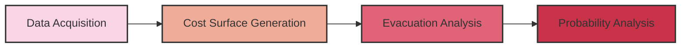
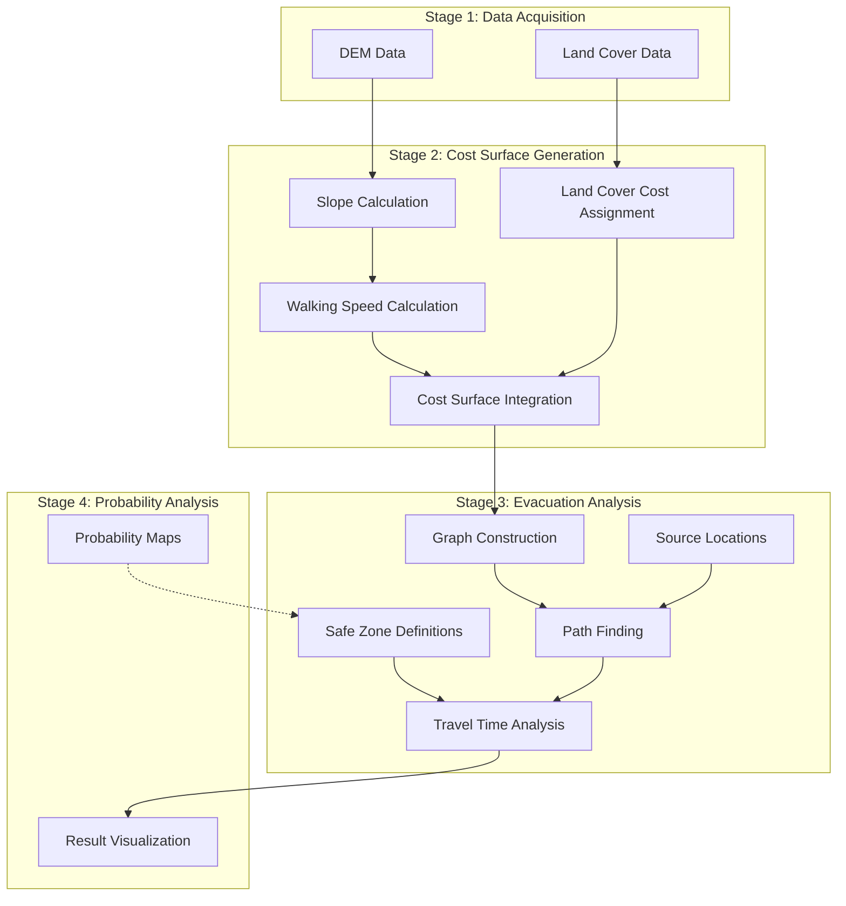

# Workflow Overview

The Volcano Pedestrian Evacuation Analysis toolkit follows a structured workflow that takes you from raw geographic data to comprehensive evacuation analysis. This page provides an overview of the complete analysis pipeline.

## Analysis Pipeline

The workflow consists of four main stages:

Each stage builds upon the outputs of the previous stage, creating a complete analysis pipeline.

## Stage 1: Data Acquisition

**Purpose**: Obtain high-quality elevation and land cover data for the study area

**Key Activities**:
- Define area of interest around the volcano
- Download Digital Elevation Model (DEM) data
- Download land cover classification data
- Ensure proper projection and resolution

**Outputs**:
- DEM raster in GeoTIFF format
- Land cover raster in GeoTIFF format

[Learn more about Data Acquisition →](data-acquisition.md)

## Stage 2: Cost Surface Generation

**Purpose**: Create cost surfaces that represent the difficulty of traversing the terrain

**Key Activities**:
- Calculate slopes from the DEM
- Apply Tobler's hiking function to estimate walking speeds
- Assign travel costs to different land cover types
- Combine slope-based and land cover-based costs
- Generate final cost surfaces for different directions

**Outputs**:
- Walking speed rasters based on slope
- Land cover cost rasters
- Integrated cost surface rasters

[Learn more about Cost Surface Generation →](cost-surface.md)

## Stage 3: Evacuation Analysis

**Purpose**: Calculate optimal evacuation routes and travel times from various starting points

**Key Activities**:
- Define source locations (volcano summit, campsites, settlements)
- Apply path-finding algorithms to find optimal evacuation routes
- Calculate travel times for different walking speeds
- Analyze safe zone accessibility based on distance from the volcano
- Decompose evacuation routes to understand influential factors

**Outputs**:
- Evacuation route maps
- Travel time analyses for different scenarios
- Statistical summaries of evacuation scenarios

[Learn more about Evacuation Analysis →](evacuation-analysis.md)

## Stage 4: Probability Analysis 

**Purpose**: Incorporate eruption probability models to refine evacuation planning

**Key Activities**:
- Integrate volcanic hazard probability maps
- Define safe zones based on probability thresholds
- Compare evacuation scenarios for different eruption intensities (VEI levels)
- Generate visualizations that communicate risk levels

**Outputs**:
- Probability-based evacuation maps
- Scenario comparisons across VEI levels
- Statistical reports integrating probability thresholds

## Modular Design

The workflow is designed to be modular, allowing you to:

- Run individual stages independently
- Iterate on specific aspects without rerunning the entire pipeline
- Customize parameters at each stage to suit your specific research questions
- Compare multiple scenarios with different assumptions

## Data Flow Diagram

The following diagram illustrates how data flows through the system:

## Next Steps

To begin working with the toolkit:

1. First, ensure you have all [required dependencies installed](installation-requirements.md)
2. Proceed to the [Data Acquisition](data-acquisition.md) step to obtain necessary data
3. Follow each stage sequentially, reviewing outputs at each step

Each section of the workflow documentation includes detailed instructions, code examples, and troubleshooting tips to guide you through the process.
